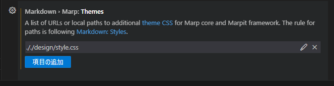

# MarpSlide

- Marpを使用したスライド作成の練習

## Marp とは

- Markdown でスライドを作成するツール。
- VSCode の拡張機能。

### 利点

- 既存の Markdown ドキュメントを再利用可能
- Git でバージョン管理可能
- デザイン(css)とドキュメントを分離できる
- Markdown 形式なためAIと相性が良い

### 欠点

## 準備

- プラグイン追加
  - [Marp のリンク](https://marketplace.visualstudio.com/items?itemName=marp-team.marp-vscode)
- VSCode での設定方法
  1. ファイル > ユーザー設定 > 設定 を開く。
  2. 検索窓で `markdown.marp.themes` を入力し検索する。
  3. css ファイルのパスを入力する。
     - 例：`././design/style.css`
  

## 出力

- Marp アイコンを押し、`Export slide deck...` を選択し、出力する。
  - 例：pdf/base.pdf

## 参考資料

- [【VS Code + Marp】Markdownから爆速・自由自在なデザインで、プレゼンスライドを作る](https://qiita.com/tomo_makes/items/aafae4021986553ae1d8)
- [Marp 公式ドキュメント](https://marp.app/)
- [サンプル](https://github.com/classmethod/classmethod-marp-theme/blob/main/sample-slide.md)
